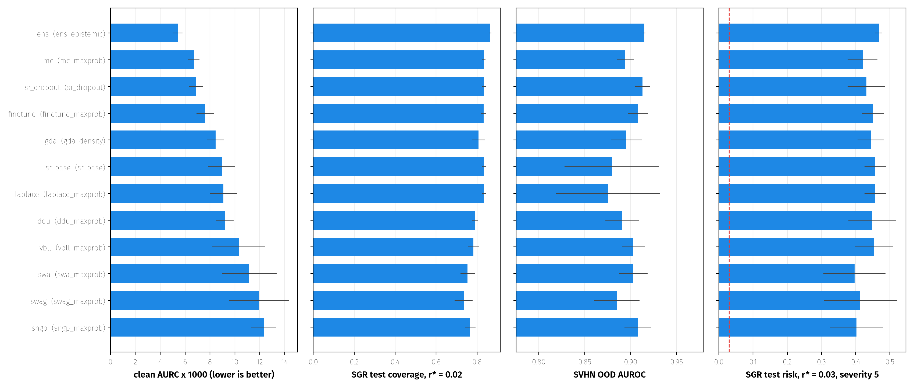
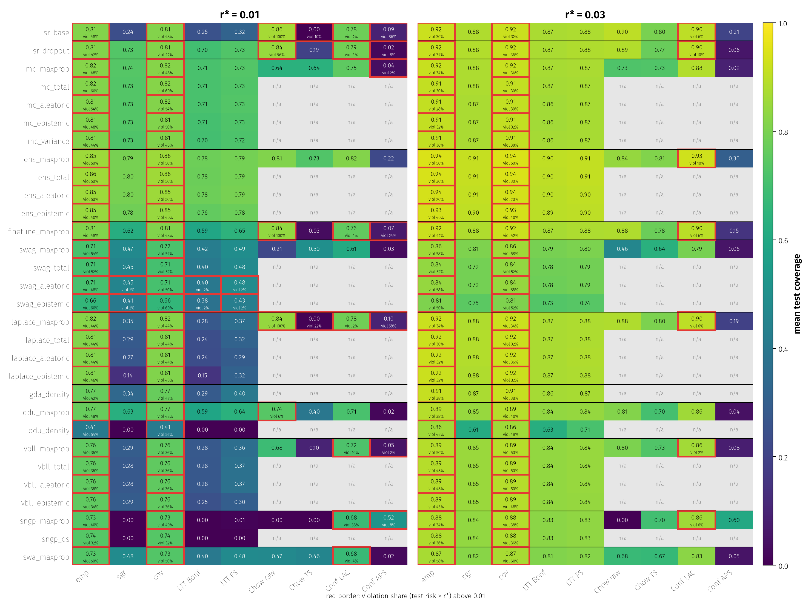
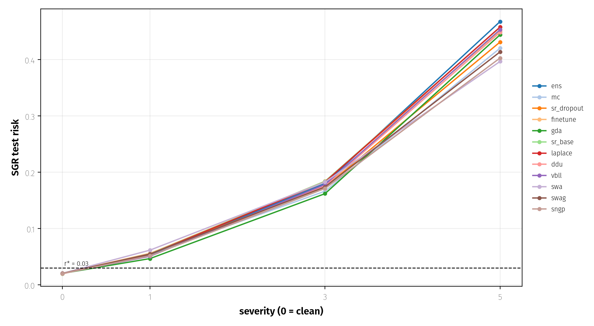
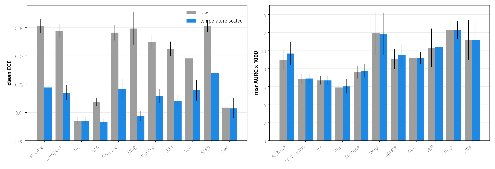

# Results: method comparison for selective prediction on CIFAR-10

CIFAR-10, VGG-16, 5 training seeds x 10 random 5k/5k selection/test splits of the test set. The threshold is
picked on the selection half and evaluated on the test half. SGR uses delta = 0.001. "Violation" means that the
test risk exceeds r* on a split. The deep ensemble uses the five base models as members, so there is only one
ensemble and its spread comes from the random splits alone. Figures are in `results/summary/` and are rebuilt from the CSVs with
`uv run python scripts/plot_results.py`.

## One main score per method

Every method can produce several criteria (maxprob, entropy decomposition, density, ...). For the comparison each
method gets the one criterion with the lowest clean AURC:

| method | main score | clean AURC x1000 |
|---|---|---|
| deep ensemble | `ens_epistemic` | 5.4 |
| MC dropout | `mc_maxprob` | 6.7 |
| dropout model, softmax | `sr_dropout` | 6.85 |
| fine-tuned base | `finetune_maxprob` | 7.6 |
| GDA | `gda_density` | 8.5 |
| base, softmax | `sr_base` | 8.95 |
| Laplace | `laplace_maxprob` | 9.1 |
| DDU | `ddu_maxprob` | 9.2 |
| VBLL | `vbll_maxprob` | 10.3 |
| SWA | `swa_maxprob` | 11.1 |
| SWAG | `swag_maxprob` | 11.9 |
| SNGP | `sngp_maxprob` | 12.3 |

For most methods, maxprob of the mean prediction is their best selection score. The extra machinery is better used
to improve the mean prediction than as a separate score. `ddu_density` (17.7) is the worst score overall.

## What holds

- **The guarantee.** SGR and both LTT variants never violate r* on clean data (0% of splits for all criteria at
  r* in {0.01, ..., 0.06}). The one exception is swag_aleatoric/epistemic, at 2% of splits at r* = 0.01, which is
  within delta-level noise for 50 splits. LTT Bonferroni costs about 1 point of coverage relative to SGR.
  LTT fixed-sequence is about equal to SGR.
- **The ranking on clean data.** The deep ensemble is best (AURC 5.4-5.9, accuracy 0.947). MC dropout and the
  dropout model's softmax follow. Methods that only change the last layer (Laplace, DDU, VBLL) do not beat the
  plain softmax of the network they start from.
- **Calibration.** Temperature scaling halves the ECE of single models (sr_base 0.041 -> 0.019, swag 0.040 ->
  0.009). MC dropout and SWA are already calibrated (ECE about 0.007-0.011, T about 1.0).

## What breaks

- **The r* = 0.01 cliff.** At r* = 0.02 all main scores certify 0.73-0.87 coverage. At r* = 0.01 SGR coverage
  depends strongly on the method: ens 0.79, mc 0.74, sr_dropout 0.73, finetune 0.62, ddu 0.63, swa 0.48,
  swag 0.48, laplace 0.35, gda 0.34, vbll 0.30, sr_base 0.24, sngp 0.00. Meanwhile emp (no guarantee) reaches
  0.73-0.86 coverage for all of them. With about 5k selection points the bound needs a long prefix with almost
  no errors. Scores that put a few errors among their most confident points (sr_base, SNGP) lose almost all of
  their coverage. sr_base is bimodal across splits (std about 0.34), and LTT does not change this.
- **SNGP and ddu_density certify nothing at r* = 0.01.** sngp_maxprob, sngp_ds and ddu_density reach coverage 0
  for SGR and LTT, while emp sits at 0.73 (0.41 for ddu_density). Maxprob is recomputed in float64, so these are
  not float ties. The SNGP risk-coverage curve stays around 0.0085 at 70% coverage and does not drop at low
  coverage. `scripts/check_sgr_path.py` confirms a genuine risk floor: the smallest Clopper-Pearson bound over
  all prefixes of the selection half is above 0.01 for every seed (sngp_maxprob 0.0115-0.0148, sngp_ds
  0.0120-0.0146, ddu_density 0.0136-0.0284). So no threshold can be certified, and this is not a selector bug.
  sr_base's bimodality is per seed: seed 3 (min bound 0.0073) certifies on all splits, while seeds 0, 1 and 4
  (0.0102-0.0111) almost never do.
- **Unguaranteed rules.** emp and cov violate r* in 20-60% of splits. Raw Chow (threshold on the softmax)
  violates in 96-100% of splits at r* = 0.01 for sr_base, sr_dropout, finetune and laplace, and is fine at 0.03.
  Chow after temperature scaling is far too conservative. Conformal LAC gives the highest coverage at r* = 0.01,
  but its guarantee is only marginal, and it violates in 2-10% of splits (38% for SNGP). APS singletons are
  useless (coverage < 0.3).
- **The guarantee under shift.** The guarantee holds only on the distribution it was certified on (clean risk at
  r* = 0.03 is about 0.02). At severity 1, contrast and blur keep the risk at about 0.02, pixelate reaches about
  0.03, and gaussian noise reaches 0.08-0.17. At severity 3 every method is at 0.13-0.19, and at severity 5 at
  0.32-0.47. The corruption type matters more than the method. The ensemble is worst at severity 5 (0.47, at
  higher coverage).
- **TS does not improve ranking.** Temperature scaling leaves the maxprob ranking almost unchanged and slightly
  raises sr_base msr AURC (8.9 -> 9.7). With T fitted on clean data it helps sr/ens under shift, but hurts SWAG
  and SNGP (T < 1).

## Who wins where

| setting | best | note |
|---|---|---|
| clean AURC | deep ensemble | then MC dropout, dropout softmax |
| certified coverage, r* = 0.01 | deep ensemble (0.79) | MC dropout and dropout softmax close (0.73-0.74) |
| certified coverage, r* >= 0.02 | deep ensemble | most others within 1-5 points |
| OOD AUROC (SVHN) | ensemble total/aleatoric (0.92-0.93), swag_aleatoric (0.925) | density scores do not win: gda 0.895, ddu_density 0.85 |
| OOD AUROC (CIFAR-100) | ensemble (epistemic 0.895) | gda 0.874, ddu_density 0.83 |
| mild shift | density scores degrade least (ddu_density sev 1 risk 0.035, sev 3 0.127) | at much lower coverage; mc and swag aleatoric/total also lower |
| calibration | MC dropout, SWA (no TS needed) | TS fixes single models |

Two expectations do not hold:

1. Distance-aware scores (GDA, DDU density) do not detect OOD better than softmax-based scores.
2. The epistemic part of the entropy decomposition is worse than total or aleatoric uncertainty for MC dropout
   (SVHN AUROC 0.868 vs 0.899/0.916), SWAG (0.80) and Laplace. It only helps for the ensemble on CIFAR-100.

## Cost

The axes per method are:

- training: fine-tuning on top of the 250-epoch base;
- inference: forward passes per input;
- selection: SGR or LTT on 5k points, which takes seconds for every method.

The ensemble's lead costs 5x the training and 5x the inference. MC dropout gets most of it with one model and
100 forward passes. The single-pass methods (DDU, SNGP, VBLL, GDA) cost about the same as the base model at test
time, but none of them beats the dropout softmax.
